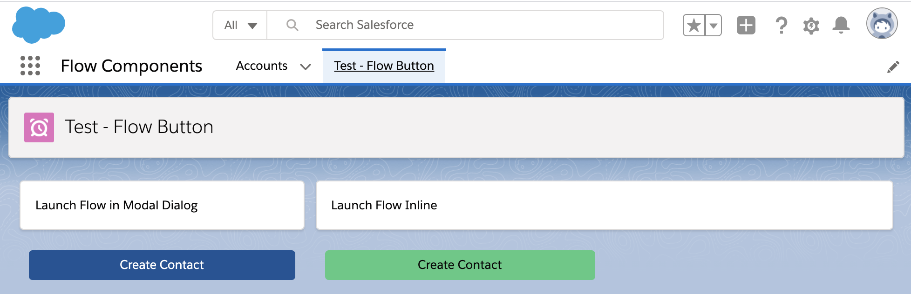
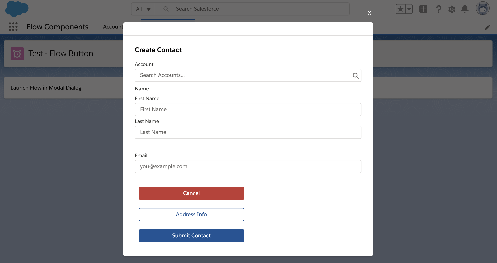
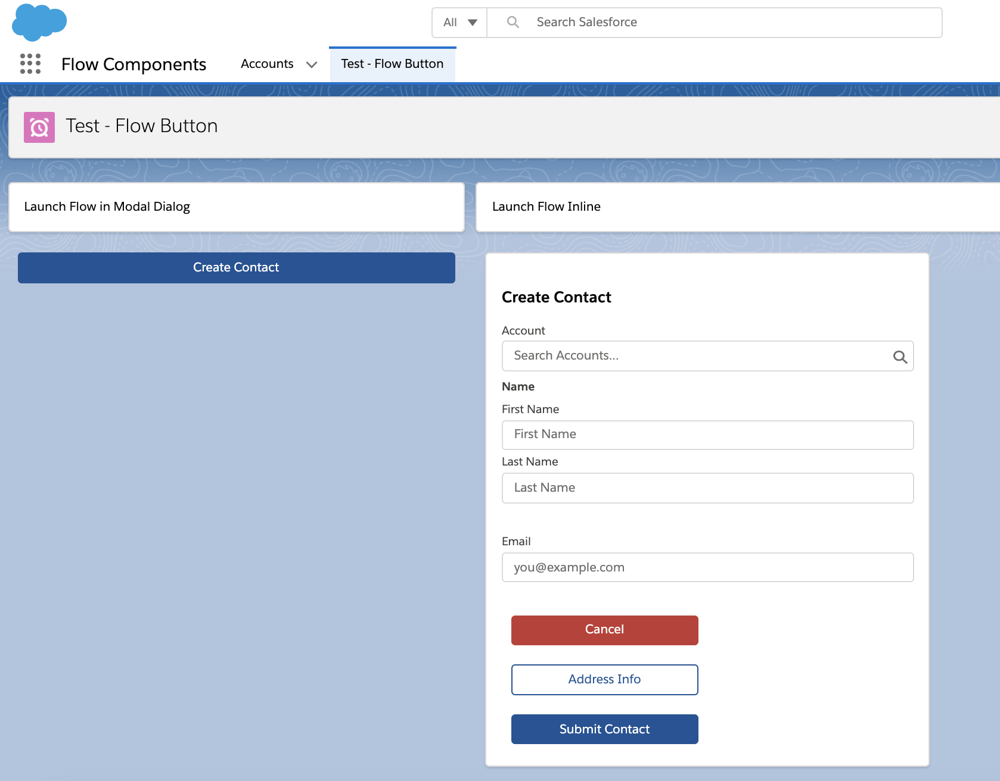
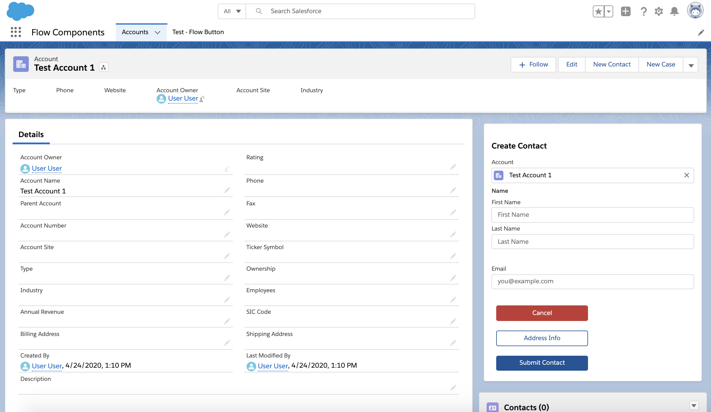
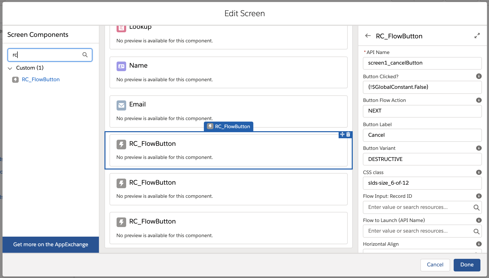

# sfdx-flow-components

----------
## RC_FlowButton

This is an Aura Lightning component button that when clicked can:

1. Launch a Flow, inline or within a modal dialog.
2. Or, if the button is within a Flow screen, handles the Flow navigation to replace the default footer buttons "Next", "Back", "Pause" and "Finish".

Samples of using this component are in the **Flow Components** app and in the **RC_FlowButtonApp** Aura application.

If the button is placed on a record detail page, the recordId will be passed to the Flow. 

If the button is within a Flow screen, it can be used to customize the Flow navigation buttons such as "Next" and "Previous".

----------
## Development

To work on this project in a scratch org:

1. [Set up CumulusCI](https://cumulusci.readthedocs.io/en/latest/tutorial.html)
2. Run `cci flow run dev_org --org dev` to deploy this project.
3. Run `cci org browser dev` to open the org in your browser.