# sfdx-flow-components

----------
## RC_FlowButton

This is an Aura Lightning component button that when clicked can:

1. Launch a Flow, inline or within a modal dialog.

Within another Lightning component: 

`<c:RC_FlowButton buttonLabel="Submit" variant="BRAND" 
                     flowToLaunch="Create_Contact"
                     showFlowInModal="true"
                     />`

On a Lightning page: 

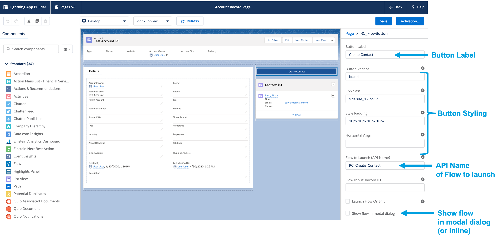

2. If the button is within a Flow screen, it handles the Flow navigation to replace the default footer buttons "Next", "Back", "Pause" and "Finish".

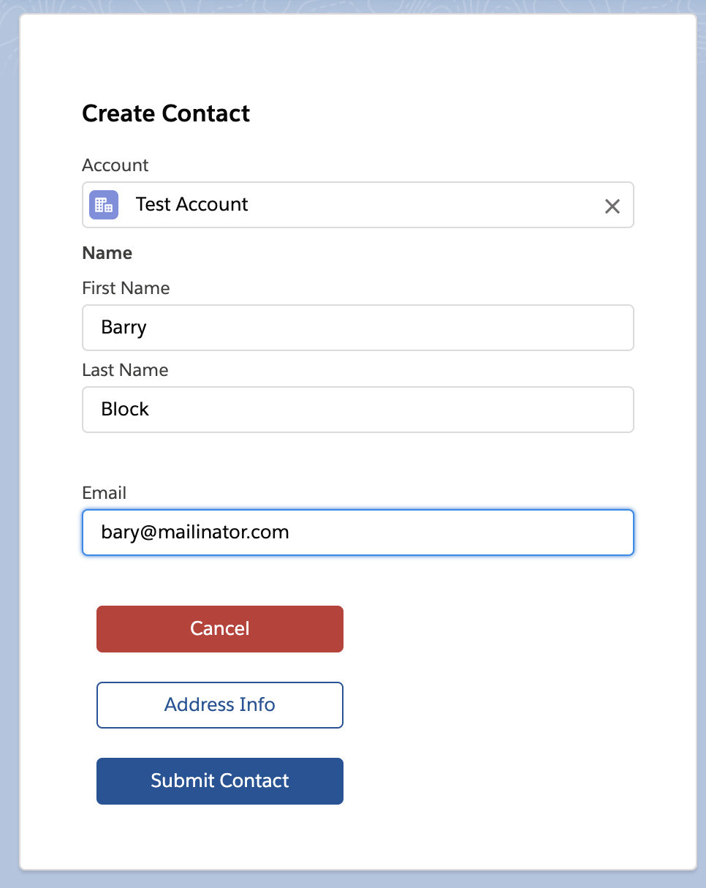

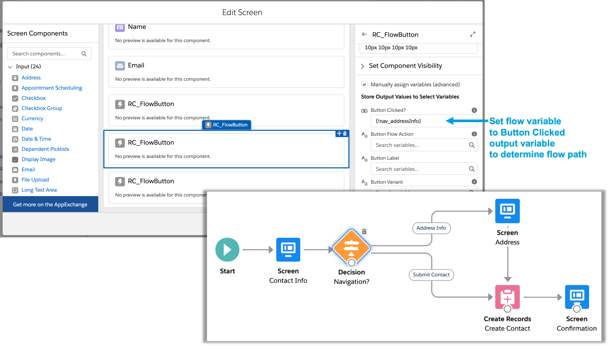

3. If the button is within a Flow screen, it can also be used to automatically launch a subflow without displaying the button at all. Then when the subflow is completed, one of the flow actions ("Next", "Finish") is performed to continue the parent flow.

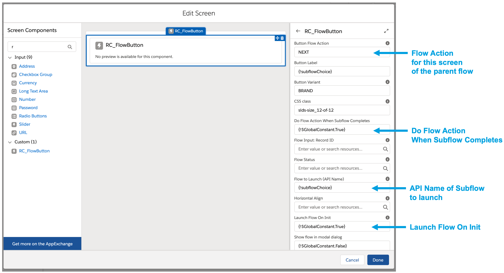

Samples of using this component are in the **RC_FlowButtonApp** Aura application and **Flow Components** app.

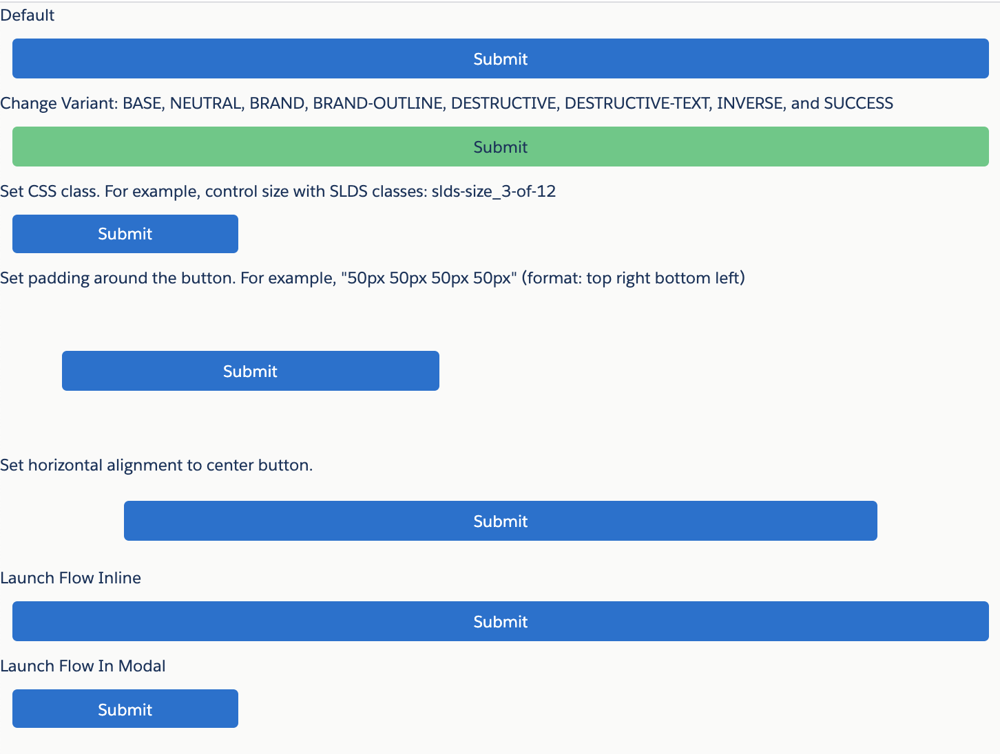

If the button is placed on a record detail page, the recordId will be passed to the Flow. 

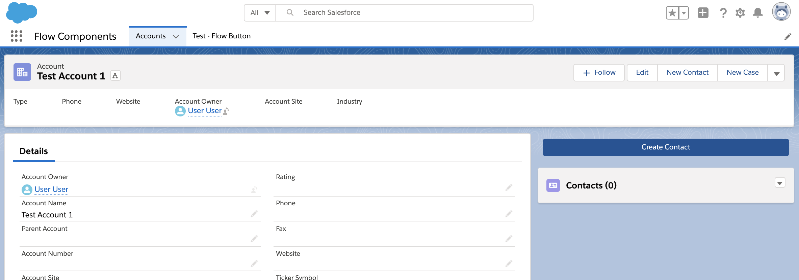

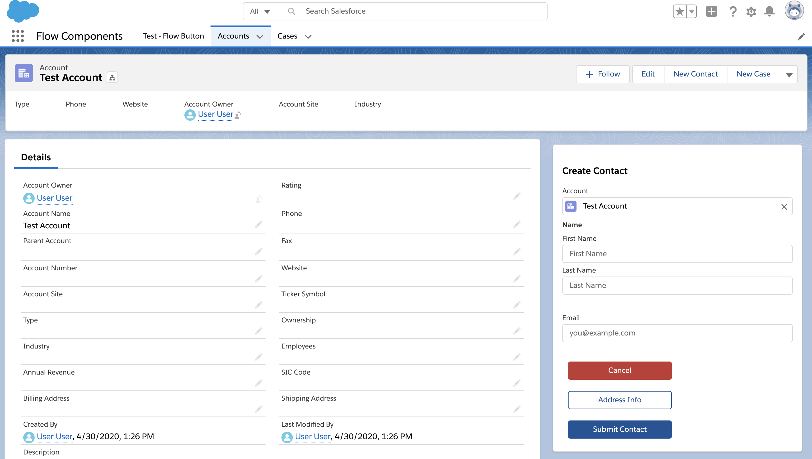

Dynamically launch subflows. Two example flows for doing this are the "Flow Router" and "Case Status Router".

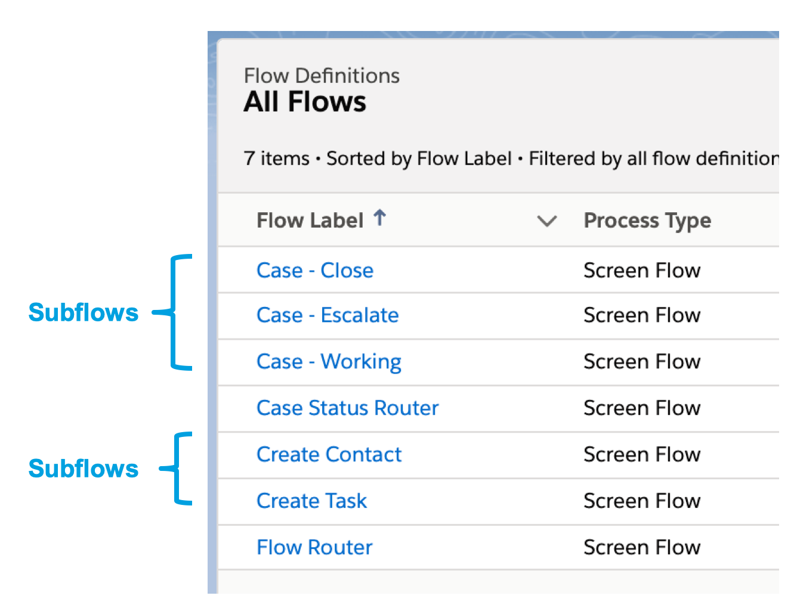

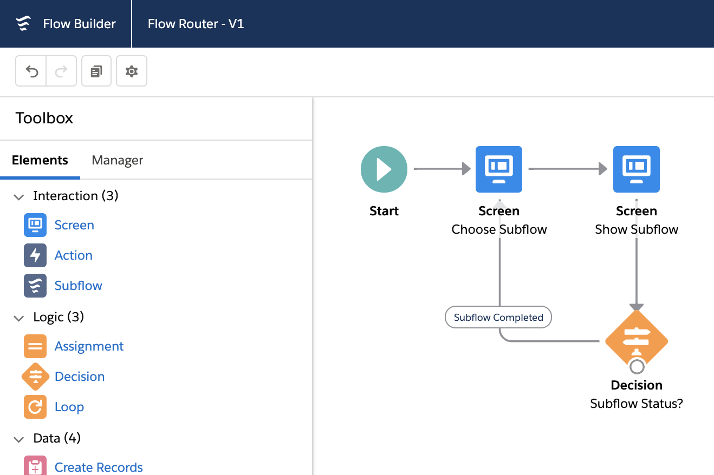

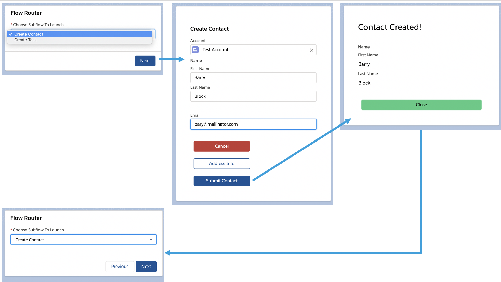

The "Case Status Router" flow is configured on the Case record page. 

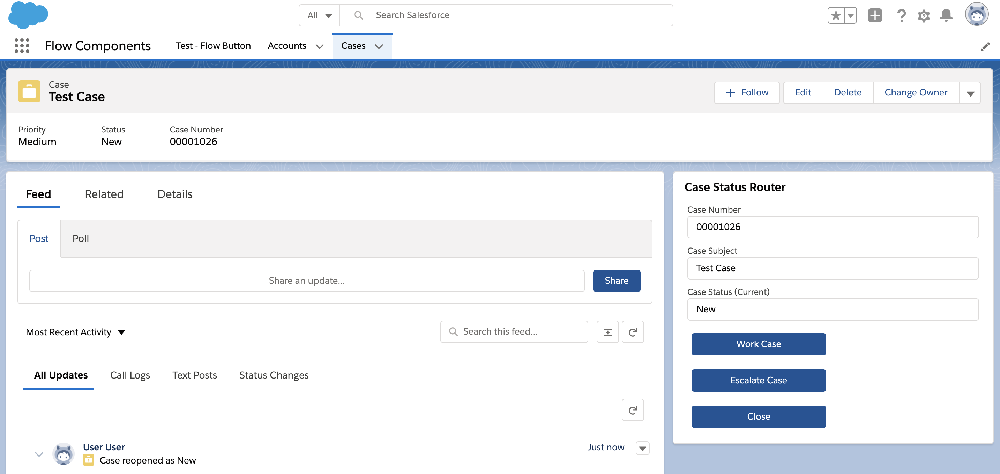

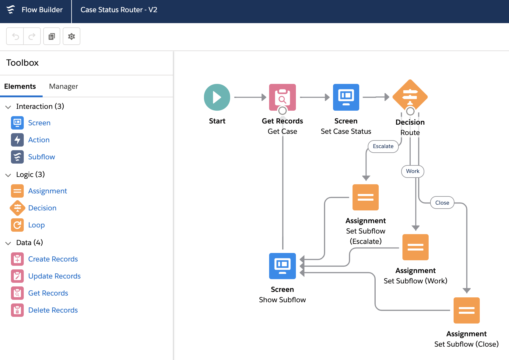

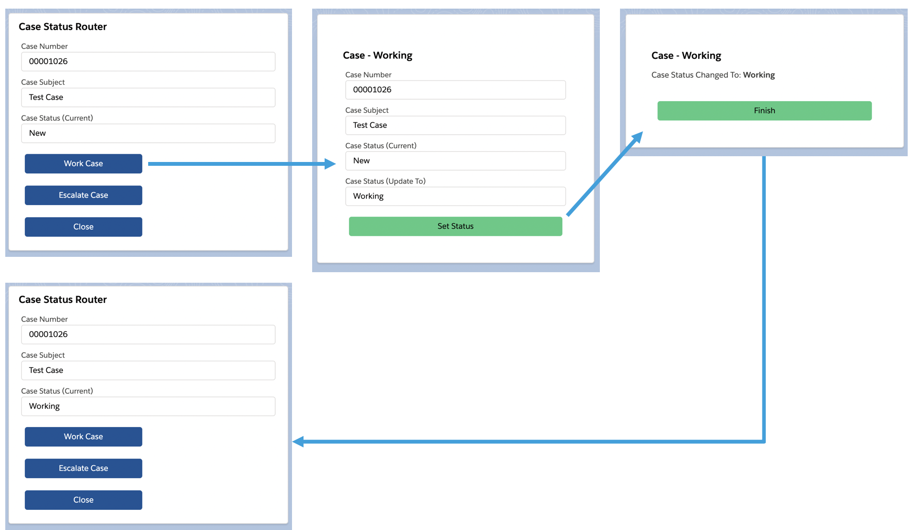

----------
## Development

To work on this project in a scratch org:

1. [Set up CumulusCI](https://cumulusci.readthedocs.io/en/latest/tutorial.html)
2. Run `cci flow run dev_org --org dev` to deploy this project.
3. Run `cci org browser dev` to open the org in your browser.